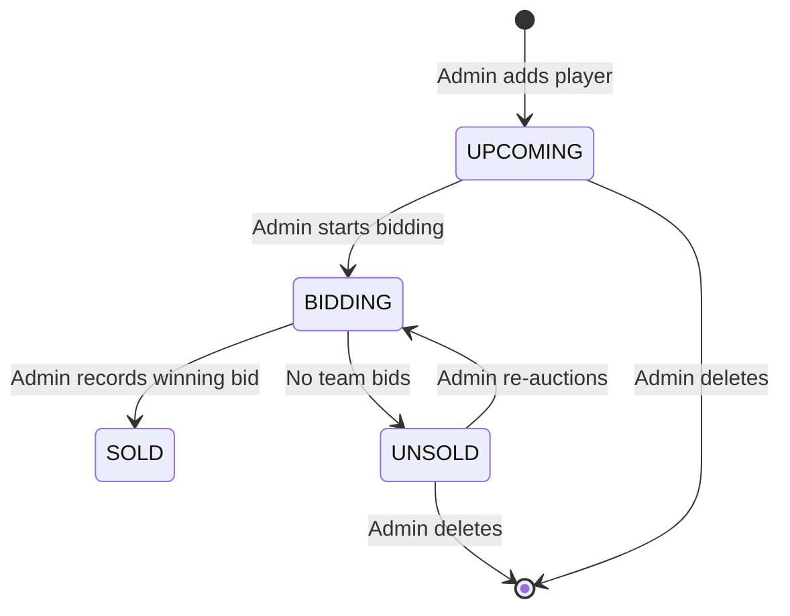

# 🏏 Crickathon Auction System — API Documentation

## What Is This?

The Auction System is an **offline, IPL-style player auction** for Crickathon events. Before the hackathon begins, teams use their **wallet points** to bid for **star players** (pre-registered expert participants). An admin runs the auction in-person and records the final winning bid through the admin dashboard.

### How It Works (Flow)

```
┌─────────────────────────────────────────────────────────────┐
│                    AUCTION LIFECYCLE                         │
│                                                             │
│  Admin adds players ──► Players sit in UPCOMING queue       │
│                                                             │
│  Admin clicks "▶ Bid" ──► Player moves to BIDDING           │
│  (shown on projector spectator view)                        │
│                                                             │
│  Teams bid verbally (offline, in the room)                  │
│                                                             │
│  Admin records final bid:                                   │
│    ├─► "🔨 SOLD"  ──► Wallet deducted, player assigned      │
│    └─► "❌ UNSOLD" ──► Player goes to UNSOLD pool           │
│                                                             │
│  Unsold players can be re-auctioned later                   │
└─────────────────────────────────────────────────────────────┘
```

### Player Status State Machine



| Status | Meaning |
|--------|---------|
| `UPCOMING` | In the queue, not yet auctioned |
| `BIDDING` | Currently on the auction block (live) |
| `SOLD` | Won by a team, wallet deducted, player assigned |
| `UNSOLD` | No team bid, can be re-auctioned |

---

## Data Model

### StarPlayer Object

```json
{
  "player_id": "uuid",
  "event_id": "uuid",
  "name": "John Doe",
  "bio": "Expert in React Native",
  "specialization": "Frontend",
  "photo_url": "https://...",
  "base_price": 25,
  "sold_price": 40,
  "sold_to_team_id": "uuid or null",
  "status": "UPCOMING | BIDDING | SOLD | UNSOLD",
  "display_order": 0,
  "created_at": "2025-01-15T10:30:00Z"
}
```

### Key Business Rules

| Rule | Details |
|------|---------|
| **Base price** | Default is `25` points, configurable per player |
| **Bid increment** | Must be in multiples of `5` (e.g., 25, 30, 35...) |
| **Wallet check** | Team must have enough wallet balance to cover the bid |
| **One at a time** | Only one player can be in `BIDDING` status at a time (enforced by UI) |
| **Auto-assignment** | When sold, player is automatically added to the team as an `icon_player` |
| **Ledger tracking** | Every sale creates a `LedgerTransaction` with type `WALLET_DEDUCTION` |
| **Cannot delete sold** | Only `UPCOMING` and `UNSOLD` players can be deleted |

---

## API Endpoints

**Base URL:** `/api/auction`

### 🟢 Public Endpoints (No Auth)

#### `GET /api/auction/players?event_id={uuid}`

List all star players for an event. Used by the spectator/projector view.

**Query Params:**
| Param | Type | Required | Description |
|-------|------|----------|-------------|
| `event_id` | UUID | ✅ | The event to list players for |

**Response:** `200 OK`
```json
[
  {
    "player_id": "abc-123",
    "event_id": "evt-456",
    "name": "Alice",
    "bio": null,
    "specialization": null,
    "photo_url": null,
    "base_price": 25,
    "sold_price": null,
    "sold_to_team_id": null,
    "status": "UPCOMING",
    "display_order": 0,
    "created_at": "2025-01-15T10:30:00"
  }
]
```

---

#### `GET /api/auction/players/{player_id}`

Get a single star player's details.

**Response:** `200 OK` — StarPlayer object

---

### 🔒 Admin Endpoints (Requires `ADMIN` or `SUPER_ADMIN` role)

All admin endpoints require a **Firebase ID Token** in the `Authorization` header:
```
Authorization: Bearer <firebase-id-token>
```

---

#### `POST /api/auction/players`

Add a star player to the auction pool.

**Request Body:**
```json
{
  "event_id": "uuid (required)",
  "name": "Player Name (required)",
  "bio": "Optional bio text",
  "specialization": "Optional — e.g., Frontend, Backend, Design",
  "photo_url": "Optional URL to player photo",
  "base_price": 25,
  "display_order": 0
}
```

**Response:** `201 Created` — StarPlayer object

**Errors:**
| Code | When |
|------|------|
| `404` | Event not found |
| `403` | User doesn't have admin role or org scope |

---

#### `PATCH /api/auction/players/{player_id}/start-bidding`

Put a player on the auction block. Changes status from `UPCOMING`/`UNSOLD` → `BIDDING`.

**Request Body:** None

**Response:** `200 OK` — StarPlayer object with `status: "BIDDING"`

**Errors:**
| Code | When |
|------|------|
| `404` | Player not found |
| `422` | Player status isn't `UPCOMING` or `UNSOLD` |

**Side Effects:**
- Pushes player to Firebase RTDB at `/auction/{event_id}/current`
- Updates `/auction/{event_id}/players/{player_id}`

---

#### `POST /api/auction/players/{player_id}/sell`

Record the final winning bid. **This is the critical transaction endpoint.**

**Request Body:**
```json
{
  "team_id": "uuid — the winning team",
  "amount": 30
}
```

**Response:** `200 OK` — StarPlayer object with `status: "SOLD"`

**Validation Rules:**
| Check | Error |
|-------|-------|
| Player must be in `BIDDING` status | `422` |
| `amount` must be ≥ `base_price` | `422` |
| `amount` must be divisible by `5` | `422` |
| Team must have enough wallet balance | `422` |
| Team must exist | `404` |

**What happens atomically (single DB transaction):**
1. ✅ Team's `wallet_balance` is reduced by `amount`
2. ✅ A `LedgerTransaction` is created (type: `WALLET_DEDUCTION`)
3. ✅ Player's `status` → `SOLD`, `sold_price` and `sold_to_team_id` are set
4. ✅ Player is added to `TeamMember` table with `is_icon_player = true`
5. ✅ Firebase RTDB is updated (team wallet, player state, current player)

**Race Condition Protection:** Uses `SELECT ... FOR UPDATE` row-level locking on the team row to prevent double-spending if two admin tabs try to sell simultaneously.

---

#### `POST /api/auction/players/{player_id}/unsold`

Mark a player as unsold (no team bid on them).

**Request Body:** None

**Response:** `200 OK` — StarPlayer object with `status: "UNSOLD"`

**Side Effects:**
- Clears the `/auction/{event_id}/current` node in Firebase
- Player can be re-auctioned later via `start-bidding`

---

#### `DELETE /api/auction/players/{player_id}`

Remove a player from the auction pool entirely.

**Response:** `204 No Content`

**Errors:**
| Code | When |
|------|------|
| `422` | Player status is `SOLD` or `BIDDING` (can't delete active/sold players) |

---

## Firebase Realtime Database (RTDB) Structure

The backend pushes state to Firebase RTDB so the **spectator view** and **admin page** get real-time updates without polling.

```
/auction/
  {event_id}/
    current/                    ← The player currently being auctioned
      player_id: "uuid"
      name: "Alice"
      base_price: 25
      sold_price: null
      sold_to_team_id: null
      status: "BIDDING"

    players/                    ← All players in the pool
      {player_id}/
        player_id: "uuid"
        event_id: "uuid"
        name: "Alice"
        bio: "..."
        base_price: 25
        sold_price: 40
        sold_to_team_id: "uuid"
        status: "SOLD"
        display_order: 0
```

### Frontend: How to Listen

```typescript
import { ref, onValue } from "firebase/database";
import { rtdb } from "@/lib/firebase";

// Listen to current player on the block
const currentRef = ref(rtdb, `/auction/${eventId}/current`);
onValue(currentRef, (snapshot) => {
  const player = snapshot.val(); // null when no active bidding
});

// Listen to all players
const playersRef = ref(rtdb, `/auction/${eventId}/players`);
onValue(playersRef, (snapshot) => {
  const data = snapshot.val(); // { player_id: {...}, player_id: {...} }
  const players = data ? Object.values(data) : [];
});
```

Or use the provided hook:

```typescript
import { useAuction } from "@/hooks/useAuction";

const {
  players,          // All players
  currentPlayer,    // Player on the block (from /current)
  biddingPlayer,    // Player with status BIDDING
  soldPlayers,      // Players with status SOLD
  unsoldPlayers,    // Players with status UNSOLD
  upcomingPlayers,  // Players with status UPCOMING
} = useAuction(eventId);
```

---

## Frontend Pages

### Admin Auction Page — `/admin/auction`

**Auth:** Requires login as `ADMIN` or `SUPER_ADMIN`

Three-column layout:
| Column | Content |
|--------|---------|
| **Left** | Add player form + upcoming queue + unsold list |
| **Center** | Current auction block (player card, sell/unsold buttons) |
| **Right** | Team wallet balances + sold players log |

### Spectator View — `/auction?event_id={uuid}`

**Auth:** Public (no login required)

Designed for **projector display** during the auction event. Shows:
- Large player card with name and base price
- "SOLD!" animation when a player is sold
- Team purses sidebar
- Bottom ticker with team balances
- Real-time updates via Firebase RTDB

---

## Example: Full Auction Flow

```bash
# 1. Admin adds a star player
POST /api/auction/players
Body: { "event_id": "evt-1", "name": "Alice", "base_price": 25 }
# → Returns player with status: "UPCOMING"

# 2. Admin puts Alice on the block
PATCH /api/auction/players/{alice_id}/start-bidding
# → Returns player with status: "BIDDING"
# → Firebase /current is updated → spectator view shows Alice

# 3. Teams bid verbally: "30!", "35!", "40!"
# (this happens offline in the room, not through the API)

# 4. Admin records the winning bid
POST /api/auction/players/{alice_id}/sell
Body: { "team_id": "team-1", "amount": 40 }
# → Team wallet: deducted 40 pts
# → Alice: status "SOLD", sold_price: 40, sold_to_team_id: team-1
# → Alice added to team-1's members as icon_player
# → Firebase updated → spectator view shows "SOLD!" animation

# 5. If nobody bids on Bob:
POST /api/auction/players/{bob_id}/unsold
# → Bob: status "UNSOLD"
# → Firebase /current cleared → spectator view shows "Waiting"

# 6. Later, re-auction Bob:
PATCH /api/auction/players/{bob_id}/start-bidding
# → Bob: status "BIDDING" again
```

---

## Error Response Format

All error responses follow this format:

```json
{
  "detail": "Human-readable error message"
}
```

Or for validation errors:

```json
{
  "detail": [
    {
      "loc": ["body", "amount"],
      "msg": "value is not a valid integer",
      "type": "type_error.integer"
    }
  ]
}
```
