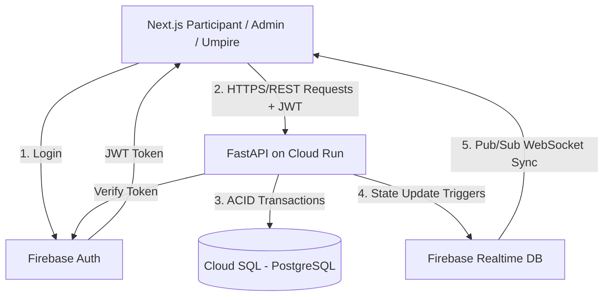

# System Architecture: Crickathon Platform

## 1. High-Level Technology Stack

To ensure performance, real-time sync, and rapid scalability while staying fully within the modern web and Google-native ecosystem:

* **Frontend:** Next.js (React) + Tailwind CSS
    * *Purpose:* Renders an ultra-premium, SEO-friendly, and accessible dashboard. Relies on React state hooks combined with WebSocket listeners for instant UI updates.
* **Backend:** FastAPI (Python)
    * *Purpose:* High-performance asynchronous API for processing complex business logic, validating Umpire actions, and securely executing wallet/run transactions.
    * *Hosting:* Google Cloud Run for automatic, containerized scaling.
* **Relational Database:** Google Cloud SQL (PostgreSQL)
    * *Purpose:* Central source of truth for the financial-grade ledger (`Ledger_Transactions`), Team State (`Runs`, `Wallet`), and RBAC structures. Provides strict ACID constraints.
    * *ORM:* SQLAlchemy / SQLModel.
* **Real-time Database:** Firebase Realtime Database (or Firestore)
    * *Purpose:* Used exclusively for high-velocity state propagation: `Event` Timer sync, and Pushing `Action Requests` notifications to Umpires.
* **Authentication:** Firebase Authentication
    * *Purpose:* Manages Email/Password and Google OAuth. JWT tokens are verified by FastAPI via custom middleware.

---

## 2. Infrastructure Diagram (Conceptual Run-Book)

---

## 3. Database Schema (PostgreSQL)

### Table: `Organization`
* `org_id`: UUID (PK)
* `name`: VARCHAR
* `created_at`: TIMESTAMP

### Table: `Event`
* `event_id`: UUID (PK)
* `org_id`: UUID (FK)
* `name`: VARCHAR
* `current_phase`: ENUM (`PRE_MATCH`, `POWERPLAY_n`, `SUPER_OVER`, `ENDED`)
* `phase_end_time`: TIMESTAMP (Nullable)

### Table: `User`
* `user_id`: UUID (PK)
* `email`: VARCHAR (UNIQUE)
* `role`: ENUM (`SUPER_ADMIN`, `ADMIN`, `UMPIRE`, `PARTICIPANT`)
* `org_id`: UUID (FK)

### Table: `Team`
* `team_id`: UUID (PK)
* `event_id`: UUID (FK)
* `name`: VARCHAR
* `umpire_id`: UUID (FK -> User)
* `wallet_balance`: INTEGER (DEFAULT: 100)
* `total_runs`: INTEGER (DEFAULT: 0)

### Table: `TeamMember`
* `member_id`: UUID (PK)
* `team_id`: UUID (FK)
* `user_id`: UUID (FK)
* `is_icon_player`: BOOLEAN (DEFAULT: FALSE)

### Table: `Ledger_Transactions`
* `transaction_id`: UUID (PK)
* `team_id`: UUID (FK)
* `type`: ENUM (`WALLET_DEDUCTION`, `RUN_ALLOCATION`, `PENALTY`)
* `amount`: INTEGER
* `reason`: VARCHAR
* `timestamp`: TIMESTAMP
* `processed_by_umpire_id`: UUID (FK -> User)

### Table: `Action_Requests`
* `request_id`: UUID (PK)
* `team_id`: UUID (FK)
* `type`: ENUM (`DRS`, `STRATEGIC_TIMEOUT`, `RETENTION`, `QUICK_SINGLE`)
* `status`: ENUM (`PENDING`, `APPROVED`, `REJECTED`, `IN_PROGRESS`, `COMPLETED`, `FAILED`)
* `created_at`: TIMESTAMP
* `duration_minutes`: INTEGER (Configurable by Admin, Default bounds e.g., 5 or 10 min)
* `point_cost`: INTEGER (Configurable by Admin, Defaults to 10 points for Retention/DRS/Timeout-Extension)
* `reward_runs`: INTEGER (Configurable by Admin, e.g., +10 for successful DRS/Quick Single)
* `penalty_runs`: INTEGER (Configurable by Admin, e.g., -5 for ignored advice, -10 for failed Quick Single)

---

## 4. Key Data Flows

### A. Phase and Timer Synchronization
1. **Admin** uses UI to set `Event.current_phase` = `POWERPLAY_1` with a 30m duration.
2. Next.js calls `POST /api/events/{id}/phase`.
3. FastAPI computes absolute `phase_end_time` (Current UTC + 30m).
4. FastAPI updates Cloud SQL.
5. FastAPI instantly pushes identical payload to **Firebase Realtime DB** under `/events/{id}`.
6. All connected Clients receive Firebase snapshot event and begin local countdown logic to prevent visual stuttering.

### B. The Transaction Ledger & Run Scoring (Umpire Action)
1. **Umpire** inputs `+45` Runs on Team Alpha.
2. Next.js calls `POST /api/teams/{id}/ledger`.
3. FastAPI opens a strict PostgreSQL transaction.
4. FastAPI creates `Ledger_Transactions` record.
5. FastAPI updates `Team.total_runs` = `Team.total_runs + 45`.
6. Transaction commits.
7. Next.js UI pulls updated data on success or listens to Firebase sync if hooked.

### C. The Paddle Economy (Action Request Processing)
1. **Participant** requests DRS.
2. Next.js calls `POST /api/requests`.
3. FastAPI writes `PENDING` request to `Action_Requests` and pushes notice to **Firebase RTDB**.
4. **Umpire** receives visual alert via Firebase listener.
5. **Umpire** Approves.
6. Next.js calls `POST /api/requests/{id}/approve`.
7. FastAPI opens PostgreSQL transaction, checks `Team.wallet_balance >= 10`.
8. Deducts `-10` from `Team`, writes to `Ledger_Transactions`, sets request to `APPROVED`.
9. Participant sees updated wallet.

---

## 5. Collaborative Development & Source Control

To support multiple developers working simultaneously via GitHub, the codebase will adhere to the following structural and workflow principles:

### A. Repository Structure
* **Frontend Modularity (Next.js):** We will use a modular folder structure. Shared UI components (buttons, cards) will live in `/src/components/ui`. Business logic will be grouped by feature (e.g., `/src/features/dashboard`, `/src/features/onboarding`). This allows developers to work on different pages or features without touching the same files.
* **Backend Modularity (FastAPI):** The backend will strictly follow an API Router pattern. Instead of a monolithic `main.py`, the app will be divided into modular domains: `/routers/users.py`, `/routers/teams.py`, `/routers/ledger.py`. Each will have distinct service and schema files.

### B. Git Workflow
* **Branching Strategy:** Developers will use feature branching (e.g., `feature/live-timer`, `feature/umpire-scoring`). 
* **Code Styling:** We will configure `ESLint` and `Prettier` on the frontend, and `Black` and `Flake8` on the backend. This ensures code format consistency so PR reviews focus purely on logic, reducing merge conflicts.
